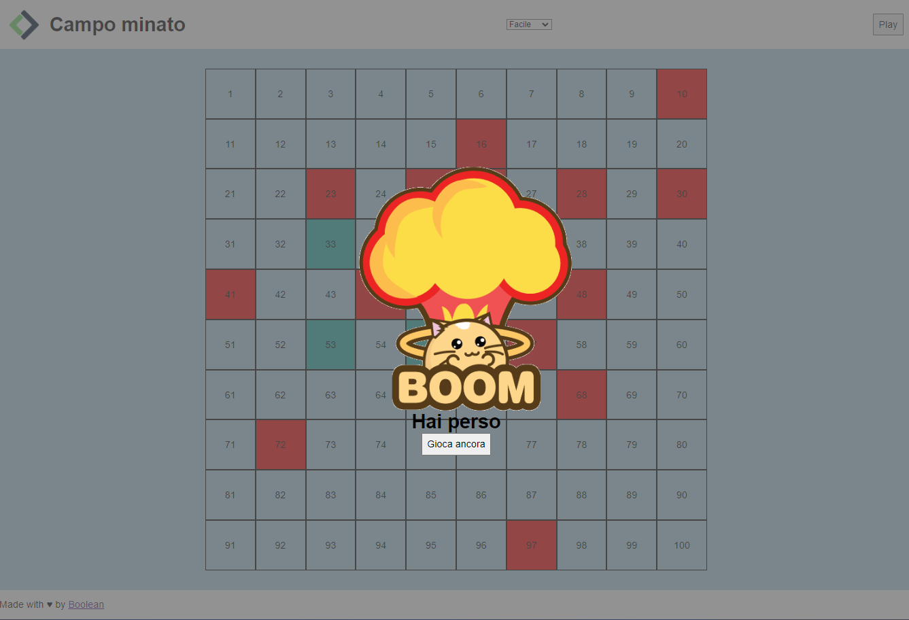
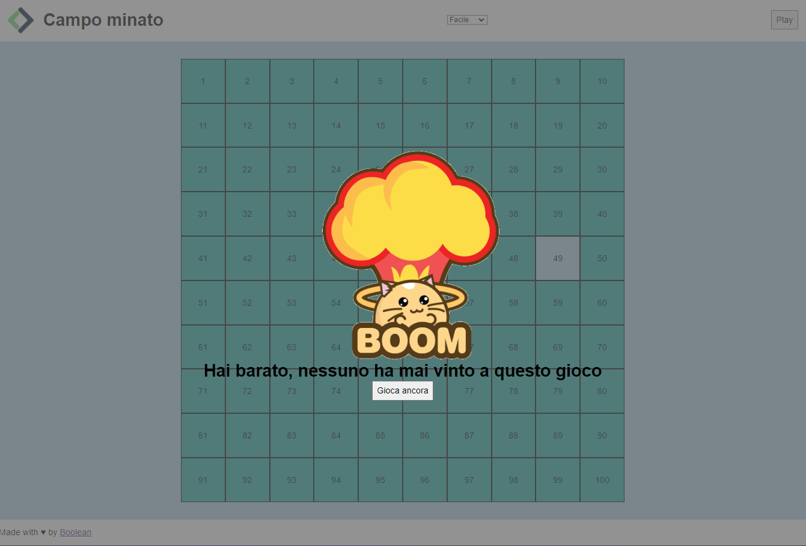

"Campo Minato" è un'applicazione web ispirata al classico gioco di Campo Minato, in cui l'obiettivo del giocatore è evitare le bombe e scoprire tutte le celle sicure della griglia.
L'applicazione è stata sviluppata in HTML CSS e JavaScript implementando diverse difficoltà di gioco:
Facile: 15 bombe
Medio: 30 bombe
Difficile: 45 bombe
Estremo: 75 bombe

Ho inserito inoltre un piccolo Easter Egg che gli sviluppatori saranno in grado di trovare

Link https://candid-salamander-9de3c1.netlify.app

### Hai perso

### Hai vinto
